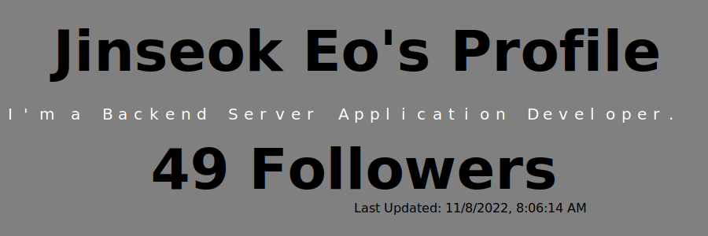

  
<!-- 

 -->
  

Expand
  
<h3>🛠 Tech Stack</h3>

  

## 🧳 Github Stats

&nbsp;

Expand

  
## 😎 Projects
  
### Web Applications

    
  
  

### Desktop Applications

  
  
    
  
      
  
      
  
### ETC
  
        
 
          
 
        

          
  

